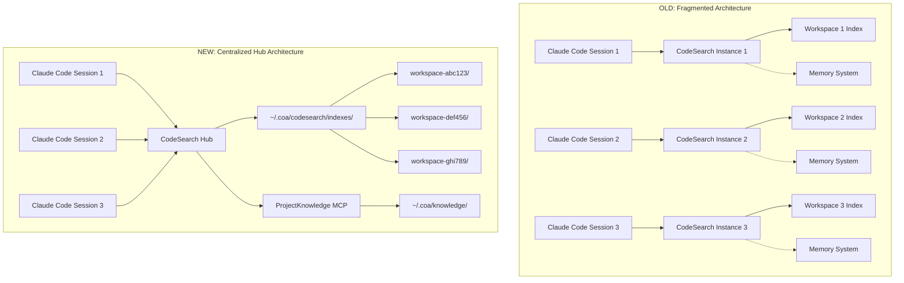
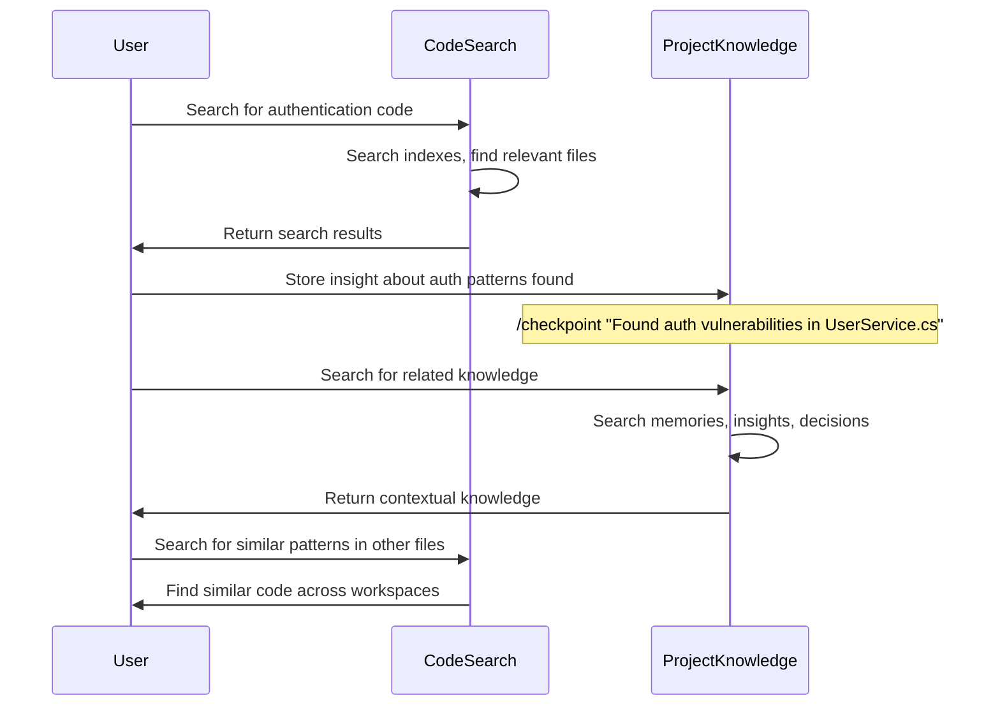

# CodeSearch: Vision and Architecture

## Why CodeSearch?

CodeSearch represents a fundamental reimagining of the COA CodeSearch MCP as a **centralized, high-performance search hub** that serves multiple workspaces while integrating seamlessly with the broader COA ecosystem.

### Problems with the Original CodeSearch

1. **Fragmented Architecture**: Each workspace maintained its own isolated index and configuration
2. **Resource Duplication**: Multiple instances running simultaneously with overlapping functionality
3. **Concurrency Issues**: Lock conflicts when multiple Claude Code sessions accessed the same workspace
4. **Maintenance Burden**: 3000+ line monolithic services that were difficult to maintain
5. **Mixed Responsibilities**: Search functionality mixed with memory management created complexity
6. **Framework Limitations**: Built on custom MCP implementation without modern framework benefits

### The CodeSearch Solution

**CodeSearch is a centralized search service that manages all workspace indexes from a single location (`~/.coa/codesearch`) and integrates with ProjectKnowledge for cross-project intelligence.**

## Architectural Revolution

### From Fragmented to Centralized



### Key Architectural Changes

#### 1. **Centralized Storage Architecture**
- **Location**: All indexes stored in `~/.coa/codesearch/indexes/`
- **Workspace Isolation**: Hash-based directory names prevent path collisions
- **Single Service**: One CodeSearch instance serves all workspaces
- **Cross-Workspace Search**: Ability to search across multiple projects simultaneously

#### 2. **Modern Framework Integration**
- **COA MCP Framework 1.4.2**: Built on our proven framework foundation
- **Progressive Disclosure**: Automatic token optimization at 5k token threshold
- **Resource Providers**: Persistent search results via `codesearch-search://` URIs
- **Prompts System**: Guided workflows for code exploration, bug finding, refactoring

#### 3. **Clean Service Architecture**

```
CodeSearch Services
├── Core Services (5 focused services instead of 1 monolith)
│   ├── PathResolutionService      # Centralized path management
│   ├── LuceneIndexService         # Split into 4 manageable files
│   ├── CircuitBreakerService      # Fault tolerance
│   ├── MemoryPressureService      # Resource monitoring  
│   └── QueryCacheService          # Workspace-isolated caching
├── Search Tools (6 specialized tools)
│   ├── IndexWorkspaceTool         # Workspace indexing
│   ├── TextSearchTool             # Full-text search
│   ├── FileSearchTool             # File name patterns
│   ├── DirectorySearchTool        # Directory exploration
│   ├── RecentFilesTool            # Time-based file discovery
│   └── SimilarFilesTool           # Code similarity search
└── Integration
    ├── HTTP Federation Mode       # Cross-service communication
    └── ProjectKnowledge Bridge     # Knowledge management
```

#### 4. **Separation of Concerns**
- **CodeSearch**: Pure search functionality (text, files, directories, code analysis)
- **ProjectKnowledge**: Knowledge management (memories, insights, decisions, checklists)
- **Clear Boundaries**: Each service excels at its core responsibility

## Integration with ProjectKnowledge

CodeSearch works seamlessly with ProjectKnowledge to provide a complete development intelligence platform.

### Knowledge Flow Pattern



### Storing Development Knowledge

When working with CodeSearch, capture important findings in ProjectKnowledge:

```bash
# After finding issues during code search
/checkpoint "Security vulnerability found in authentication flow - UserService.cs line 245 uses weak password hashing"

# Store architectural insights
/store type:ArchitecturalDecision "Authentication system uses JWT tokens with 1-hour expiration. Refresh tokens stored in HttpOnly cookies."

# Create action items from search findings  
/checklist "Fix authentication vulnerabilities" items:["Update password hashing to bcrypt","Add rate limiting to login endpoint","Implement proper session management"]

# Find related knowledge from previous work
/find "authentication security patterns"
```

## Technical Benefits

### Performance Improvements
- **Single Process**: Eliminates resource overhead of multiple instances
- **Shared Indexes**: No duplication of index data across workspaces  
- **Connection Pooling**: Reuse of search infrastructure across requests
- **Memory Efficiency**: Better cache utilization with centralized architecture

### Concurrency Resolution
- **No Lock Conflicts**: Single service manages all workspace access
- **Thread-Safe Operations**: Modern async patterns with SemaphoreSlim
- **Queue Management**: Proper request queuing and throttling
- **Resource Isolation**: Workspace operations don't interfere with each other

### Maintainability Gains
- **Focused Services**: Each service has a single, clear responsibility
- **Framework Benefits**: Automatic error handling, logging, health checks
- **Better Testing**: Clean interfaces enable comprehensive unit testing
- **Documentation**: Auto-generated API documentation from framework

## Deployment Models

### STDIO Mode (Default)
- **Use Case**: Direct integration with Claude Code
- **Protocol**: Standard MCP over stdio
- **Startup**: On-demand when Claude Code needs search functionality
- **Configuration**: Via Claude Code's MCP settings

### HTTP Federation Mode
- **Use Case**: Cross-service integration, web dashboards
- **Protocol**: RESTful API with health checks
- **Startup**: Background service with auto-restart
- **Port**: Configurable (default 5020)

### Global Tool Installation
```bash
# Install CodeSearch as global dotnet tool
dotnet tool install -g COA.CodeSearch

# Run in service mode (HTTP federation)
codesearch-next --mode http --service

# Run in stdio mode (Claude Code integration)
codesearch-next  # Default mode
```

## Migration Strategy

### Phase 1: Foundation (✅ Complete)
- [x] COA MCP Framework 1.4.2 integration
- [x] Centralized storage architecture
- [x] Core services implementation
- [x] Build and deployment pipeline

### Phase 2: Search Tools (In Progress)
- [ ] Port and enhance all search tools
- [ ] Implement progressive disclosure
- [ ] Add resource providers for result persistence
- [ ] Create guided workflow prompts

### Phase 3: Integration & Testing
- [ ] ProjectKnowledge integration testing
- [ ] Cross-workspace search functionality
- [ ] HTTP federation mode
- [ ] Performance benchmarking

### Phase 4: Production Cutover
- [ ] Data migration from old CodeSearch
- [ ] Update Claude Code configurations
- [ ] Archive legacy CodeSearch project
- [ ] Documentation and training

## Success Metrics

### Performance Targets
- **Startup Time**: < 200ms (vs 1000ms+ with multiple instances)
- **Search Speed**: < 10ms for indexed queries (maintained)
- **Memory Usage**: < 100MB typical (vs 200MB+ per instance)
- **Index Size**: 50% reduction through deduplication

### Operational Benefits
- **Zero Lock Conflicts**: Elimination of "write.lock" issues
- **Single Point of Management**: One service to monitor and maintain
- **Unified Logging**: Centralized logs in `~/.coa/codesearch/logs/`
- **Cross-Workspace Intelligence**: Search patterns across all projects

## Future Vision

CodeSearch positions us for advanced capabilities:

- **AI-Powered Insights**: Integration with code analysis AI for semantic search
- **Team Collaboration**: Shared search patterns and common queries via ProjectKnowledge
- **Enterprise Features**: Role-based access, audit trails, compliance reporting
- **Performance Analytics**: Query optimization based on usage patterns
- **Federated Search**: Integration with external search engines and repositories

---

**CodeSearch is not just a technical upgrade—it's a transformation toward a unified, intelligent development experience that scales with your team and adapts to your workflow.**