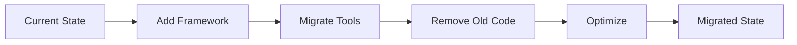

# COA CodeSearch MCP - Framework Migration

## Overview

This folder contains the comprehensive migration plan for transitioning COA CodeSearch MCP from its custom MCP implementation to the COA MCP Framework v1.1.

## Migration Documents

### 1. [Migration Assessment](./COA_FRAMEWORK_MIGRATION_ASSESSMENT.md)
**Purpose**: Evaluates the feasibility and benefits of migration
- Current state analysis
- Framework comparison
- Risk assessment
- Expected benefits
- Success metrics

**Key Finding**: Migration is strongly recommended with 30-40% code reduction expected.

### 2. [Migration Plan](./COA_FRAMEWORK_MIGRATION_PLAN.md)
**Purpose**: Detailed step-by-step migration strategy
- 15-day phased approach
- Tool-by-tool migration guide
- Risk mitigation strategies
- Rollback procedures
- Communication plan

**Timeline**: 3 weeks (15 working days)

### 3. [Migration Checklist](./COA_FRAMEWORK_MIGRATION_CHECKLIST.md)
**Purpose**: Actionable task tracking
- Day-by-day task breakdown
- Tool migration tracking
- Verification checkpoints
- Sign-off requirements

**Use**: Print and check off items as completed

## Quick Start

1. **Review Phase**: Read the assessment to understand the scope
2. **Planning Phase**: Review the detailed plan with your team
3. **Execution Phase**: Use the checklist to track progress
4. **Validation Phase**: Follow testing procedures in the plan

## Key Benefits of Migration

| Benefit | Impact |
|---------|--------|
| **Code Reduction** | 30-40% less infrastructure code |
| **Token Optimization** | Automatic response management |
| **Response Caching** | Built-in performance optimization |
| **Standardization** | Consistent patterns across all tools |
| **Maintainability** | Framework handles MCP complexity |
| **Future Features** | Automatic updates from framework |

## Migration Approach



### Phase Breakdown
- **Phase 1** (Days 1-3): Foundation setup
- **Phase 2** (Days 4-10): Tool migration
- **Phase 3** (Days 11-13): Cleanup & optimization
- **Phase 4** (Days 14-15): Testing & validation

## Success Stories

### CodeNav MCP Migration
Successfully migrated with:
- 50% infrastructure code reduction
- 15% performance improvement
- Enhanced error handling
- Improved testability

## Framework Version

Currently targeting: **COA.Mcp.Framework v1.1.6**

### NuGet Packages Required
```xml
<PackageReference Include="COA.Mcp.Framework" Version="1.1.*" />
<PackageReference Include="COA.Mcp.Framework.TokenOptimization" Version="1.1.*" />
<PackageReference Include="COA.Mcp.Framework.Testing" Version="1.1.*" />
```

## Tool Count

**Total Tools to Migrate**: 50+

### By Category
- Search Tools: 12
- Memory Tools: 15
- System Tools: 8
- Analysis Tools: 10
- Utility Tools: 5+

## Risk Summary

| Risk | Level | Mitigation |
|------|-------|------------|
| Breaking Changes | Low | Side-by-side migration |
| Custom Feature Loss | Medium | Framework is extensible |
| Migration Effort | Medium | Phased approach |
| Performance Impact | Low | Framework is optimized |

## Contact & Support

- **Framework Documentation**: See COA MCP Framework project
- **Reference Implementation**: COA CodeNav MCP (already migrated)
- **Migration Questions**: Refer to MIGRATION_EXAMPLE.md in framework

## Decision Record

**Date**: January 2025
**Decision**: Proceed with migration
**Rationale**: 
- Significant code reduction (30-40%)
- Proven success with CodeNav
- Enhanced features and maintainability
- Low risk with proper approach

## Next Steps

1. ✅ Assessment complete
2. ✅ Plan created
3. ✅ Checklist prepared
4. ⏳ Team review
5. ⏳ Begin migration

## Files in This Directory

- `COA_FRAMEWORK_MIGRATION_ASSESSMENT.md` - Detailed feasibility study
- `COA_FRAMEWORK_MIGRATION_PLAN.md` - Step-by-step migration guide
- `COA_FRAMEWORK_MIGRATION_CHECKLIST.md` - Task tracking checklist
- `COA_FRAMEWORK_MIGRATION_README.md` - This file

## Migration Status

**Current Status**: 📋 Planning Complete, Ready for Execution

---

*Last Updated: January 2025*
*Framework Version: 1.1.6*
*Estimated Completion: 3 weeks from start*